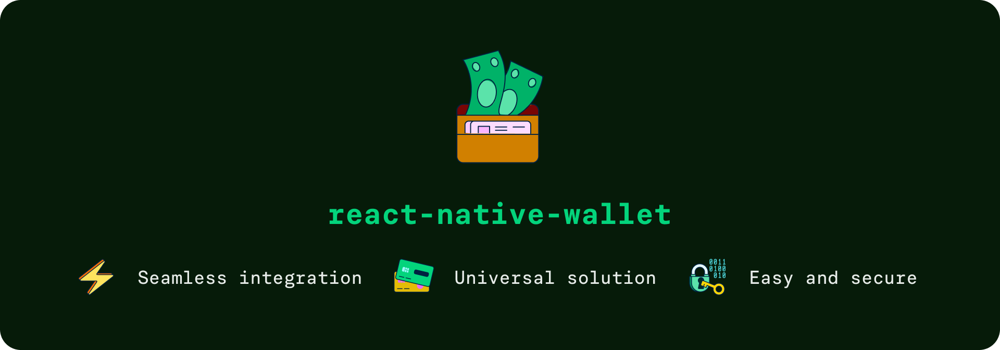

## Features
- ⚛️ Card In-App Provisioning seamless integration
- ♻️ Universal solution (Apple Wallet and Google Wallet)
- 💳 Easy and secure addition of payment cards from your app directly

## Getting started

Using the `react-native-wallet` Push Provisioning features requires proper configuration and access from both Google and Apple. 
Please follow the instructions below before installing the library:

### Android

To be able to interact with the Google Wallet on the Android please make sure to complete all of the steps below following [the Google Push Provisioning documentation](https://developers.google.com/pay/issuers/apis/push-provisioning/android/setup):

#### Step 1: Get access to Google TapAndPay SDK

1. Visit [the Google Pay Android Push Provisioning API documentation](https://developers.google.com/pay/issuers/apis/push-provisioning/android/) and request access to it.

2. Once getting an approval from the Google team
	1. Download the [TapAndPay SDK](https://developers.google.com/pay/issuers/apis/push-provisioning/android/releases). 
	2. Unzip it and extract the SDK into the `/android/libs` folder in your React Native project (if there is no `libs` folder, create one). 
	3. Add `/android/libs` to `.gitignore`.
	
3. Then connect the SDK to your project in `build.gradle`, for example like in [example/android/build.gradle](https://github.com/Expensify/react-native-wallet/blob/main/example/android/build.gradle):

```groovy
allprojects {
	repositories {
		google()
		maven { url "file://${rootDir}/libs" }
	}
}
```

#### Step 2: Whitelist your app for SDK use.

To use the Google SDK in your app, you will need to whitelist your app details. Without it, calling some functions will result in a `Not verified` error. 
To resolve it, please follow the instructions from [the official Google documentation](https://developers.google.com/pay/issuers/apis/push-provisioning/android/allowlist).

For your builds, you will need to prepare your app's `package name` and `fingerprint` following [these steps](https://developers.google.com/pay/issuers/apis/push-provisioning/android/allowlist#how_to_get_your_apps_fingerprint). The values should, for example, look like this:

```
Package name: com.app.package.name

Fingerprint: SHA256: 36:38:63:59:6E:...:00:82:16:4E:FF
```
> [!TIP]
> You can display your SHA-256 certificate checksum using `apksigner` or `keytool`.


With all the required data, submit the form and wait for Google's response. After successfully whitelisting your app you will be able to use Google SDK within our library.

---
### iOS

### Step 1: Apply for appropriate entitlements

To enable In-App Provisioning in your app, you must request activation of the appropriate Apple Pay entitlements for your developer Team ID. Enterprise Team IDs are not supported. This entitlement is not available by default in our panel; you will need to request it. Send an email to apple-pay-provisioning@apple.com with your app name, Team ID, and Adam ID.

Once Apple verifies your identity, you should get documentation named `Getting Started with Apple Pay In-App Provisioning, Verification & Security`. In this confidential document you will find all the relevant information about:
- Prerequisites for your project
- Best practices to follow
- How In-App Provisioning works
- UX requirements
- Testing process
- and more...

Make sure to familiarize yourself with that document before deploying your app.

### Step 2: Activate the entitlement

After getting a positive response from Apple, open the developer portal panel and search `Certificates, Identifiers & Profiles` -> `Profiles` -> `Our distribution profile` -> `Edit` and add the `ApplePay In-App Provisioning Distribution` entitlement. 
It’s available only for the production environment so your QA must work with physical devices and cards.


### Step 3: Add the entitlement to your project

Add `com.apple.developer.payment-pass-provisioning` entitlement to your project. Find or create `.entitlements` file in your project and add the entitlement like below (similarly to [WalletExample.entitlements](https://github.com/Expensify/react-native-wallet/blob/main/example/ios/WalletExample/WalletExample.entitlements)): 

```xml
<?xml version="1.0" encoding="UTF-8"?>
<!DOCTYPE plist PUBLIC "-//Apple//DTD PLIST 1.0//EN" "http://www.apple.com/DTDs/PropertyList-1.0.dtd">
<plist version="1.0">
<dict>
	...
	 <!-- In-App Provisioning special entitlement-->
	<key>com.apple.developer.payment-pass-provisioning</key>
	<true/>
</dict>
</plist>
```

## Installation

After completing the setup from the section above, install the `react-native-wallet` package from npm:

```sh
npm install @expensify/react-native-wallet
```
or
```sh
yarn add @expensify/react-native-wallet
```


## Required data 
Here you can find data elements used in the library, essential to work with Google Wallet and Apple Wallet APIs.

### Android
- **Opaque Payment Card** (OPC) - a binary blob of information Google Pay receives from the issuer app that could be presented to TSP to receive a token.
- **Token Service Provider** (TSP) - a service that enhances payment security by replacing a credit card number during transactions with a unique digital identifier - token. The TSP specifies the tokenization service used to create a given token e.g. Visa, MasterCard, American Express. 
- **Token Reference ID** - a unique identifying number to refer to a DPAN (Dynamic Personal Account Number). Token Providers will assign each DPAN an issuer token ID at the time of tokenization.

### iOS
- **Nonce** - a one-time nonce value generated by Apple’s servers. This nonce must be included in the add payment request’s encrypted data.
- **Nonce Signature** - the device-specific signature for the nonce. This signature must be included in the add payment request’s encrypted data.
- **Certificates** - an array of NSData objects. Each object contains a DER encoded X.509 certificate, with the leaf first and root last. You must download the root CA to validate the entire chain.
- **Encrypted Pass Data**- an encrypted JSON file containing the sensitive information needed to add a card to Apple Pay (Base 64 encoded). [More details here.](https://developer.apple.com/documentation/passkit/pkaddpaymentpassrequest/encryptedpassdata)
- **Ephemeral Public Key** - a key used by elliptic curve cryptography (ECC) (Base 64 encoded).

# API Reference
The library offers five functions for seamless integration and use of the Apple Wallet and Google Wallet APIs. Additionally, it includes one listener that informs when the added card has been activated. Below, these functions are described along with the data types involved.

## Functions

| Function | Description | Parameters | Returns / Type | iOS | Android |
|----------|-------------|------------|----------------|:---:|:-------:|
| **getSecureWalletInfo** | Returns necessary platform-specific wallet information for secure transactions. | None | `WalletData` | ✅ | ❌ |
| **checkWalletAvailability** | Checks if the wallet is ready and initializes it if possible. | None | `boolean` | ✅ | ✅ |
| **getCardStatusBySuffix** | Retrieves the current status of a card in the wallet. | `lastDigits: string`<br>(The last few digits of the card number) | `CardStatus` | ✅ | ✅ |
| **getCardStatusByIdentifier** | Returns the state of a card based on a platform-specific identifier. On Android, it's `Token Reference ID` and on iOS, it's `Primary Account Identifier`. | `identifier: string`,<br>`tsp: string` | `CardStatus` | ✅ | ✅ |
| **addCardToGoogleWallet** | Initiates native Push Provisioning flow for adding a card to the Google Wallet. | `data`: `AndroidCardData` | `TokenizationStatus` | ❌ | ✅ |
| **addCardToAppleWallet** | Initiates native Push Provisioning flow for adding a card to the Apple Wallet. | `data`: `IOSCardData`,<br>`issuerEncrypt-`<br>`PayloadCallback: IOSIssuerCallback` | `void` | ✅ | ❌ |


## Data Types

| Type | Description | Fields |
|------|-------------|--------|
| **AndroidWalletData** | Specific information for Android devices required for wallet transactions. | `deviceID: string`,<br>`walletAccountID: string` |
| **AndroidCardData** | Data related to a card that is to be added on Android platform wallets. | `network: string`,<br>`opaquePaymentCard: string`,<br>`cardHolderName: string`,<br>`lastDigits: string`,<br>`userAddress: UserAddress` |
| **UserAddress** | Structured address used for cardholder verification. | `name: string`,<br>`addressOne: string`,<br>`addressTwo: string`,<br>`city: string`,<br>`administrativeArea: string`,<br>`countryCode: string`,<br>`postalCode: string`,<br>`phoneNumber: string` |
| **IOSCardData** | Data related to a card that is to be added on iOS platform. | `network: string`,<br>`activationData: string`,<br>`encryptedPassData: string`,<br>`ephemeralPublicKey: string`,<br>`cardHolderTitle: string`,<br>`cardHolderName: string`,<br>`lastDigits: string`,<br>`cardDescription: string`,<br>`cardDescriptionComment: string` |
| **onCardActivatedPayload** | Data used by listener to notice when a card’s status changes. | `tokenId: string`,<br> `actionStatus: 'activated' \| 'canceled'`<br> |
| **IOSIssuerCallback** | This callback is invoked with a nonce, its signature, and a certificate array obtained from Apple. It is expected that you will forward these details to your server or the card issuer's API to securely encrypt the payload required for adding cards to the Apple Wallet. | `(nonce: string, nonceSignature: string, certificate: string[]) => IOSEncryptPayload` |
| **IOSEncryptPayload** | An object containing the necessary elements to complete the addition of a card to Apple Wallet. | `encryptedPassData: string`,<br>`activationData: string`,<br>`ephemeralPublicKey: string` |

## Card Status

| Type | Possible Values |
|------|-----------------|
| **CardStatus** | `not found`, `active`, `requireAuthorization`, `pending`, `suspended`, `deactivated` |

## Listeners

| Listener | Event Description | Register Function | Unregister Function |
|----------|-------------------|-------------------|---------------------|
| **_cardActivation_** | Notifies when a card's status changes to activated. | `addListener(event: string, callback: (data: onCardActivatedPayload) => void): EmitterSubscription` | `removeListener(subscription: EmitterSubscription): void` |

## Components

### `AddToWalletButton`

A ready-to-use component that simplifies the addition of payment cards to Google Wallet and Apple Wallet. The button automatically adapts its appearance according to the platform and language specified.
It uses official assets provided by [Google](https://developers.google.com/wallet/generic/resources/brand-guidelines) and [Apple](https://developer.apple.com/wallet/add-to-apple-wallet-guidelines/) in their Wallet-related branding guidelines. 

> [!IMPORTANT]
> Please bear in mind the brand rules provided by [Google](https://developers.google.com/wallet/generic/resources/brand-guidelines) and [Apple](https://developer.apple.com/wallet/add-to-apple-wallet-guidelines/) when adding this component to your application. 

Adhering to these guidelines is crucial not only to comply with legal requirements but also to reassure users of the authenticity and security of your application.

| Property | Type | Required | Description |
|----------|------|----------|-------------|
| **onPress** | `() => void` | Yes | A callback that is triggered when the button is pressed. |
| **locale** | `string` | Yes | The language code to display the correct button language. |
| **platform** | `Platform` (`ios \| android`) | Yes | The platform type to ensure the appropriate button image is implemented. |
| **buttonStyle** | `ViewStyle` | No | Customizes the button style. |

#### Usage Example:

```typescriptreact
<AddToWalletButton
  onPress={() => console.log('Button pressed!')}
  locale="en"
  platform="android"
  buttonStyle={{ height: 50 }}
/>
```

| Android | iOS |
|:----:|:---------------:|
|  |  |

# Publishing your app

To successfully publish your app, you will need to navigate through a series of mandatory test cases on both platforms.

### Android

Before deploying your app to the Google Play Store, make sure you have taken care of the security when implementing Push Provisioning and properly tested your code. To accomplish it, please familiarize yourself with [the Google's App Push Provisioning best practices](https://developers.google.com/pay/issuers/apis/push-provisioning/android/best-practices).

The latest information about deploying apps with Google TapAndPay SDK can be found in the [pre-launch process](https://developers.google.com/pay/issuers/apis/push-provisioning/android/launch-process#step_3_issuer_app_product_review) and [beta tests](https://developers.google.com/pay/issuers/apis/push-provisioning/android/beta-testing) sections in Google documentation. Make sure to complete all of the steps specified by Google connected to the __Google's branding__, __API safety__, and __app stability__.

The app will need to be reviewed by Google. During this process, it will need to pass 4 mandatory test cases that are specified [here](https://developers.google.com/pay/issuers/apis/push-provisioning/android/test-cases). They verify how your app handles card state tracking in different scenarios. 

> [!NOTE]
>Please make sure to hide the `Add to Google Wallet` buttons when cards are already added to the wallet.

### iOS

When implementing the In-App Push Provisioning feature in your App make sure that your app follows Apple's [branding guidelines connected to Apple Wallet](https://developer.apple.com/wallet/add-to-apple-wallet-guidelines/). Remember that you must not create your own buttons or your app could be rejected at revision. You can use the[ AddWalletButton component](#components) instead! 
When the pass is already provisioned, make sure to hide this button and replace it with text like `Added to Apple Wallet`. The card is fully provisioned once it added to your main device (user's iPhone) and all linked devices (for example Apple Watch).

Next to branding guidelines, please follow the instructions and best practices from [the In-App provisioning documentation]((#ios)) provided by Apple.

The In-App Provisioning feature must be reviewed and verified by Apple's certification team before submitting your app to the App Store. Below are some key scenarios that may be tested during the review process:
- Enrolling a card into Apple Wallet
- Enrolling a card into the Apple Watch
- Attempting to enroll a card that has already been added via the Wallet app
- Manually adding a card using its IBAN
- Adding multiple cards from the same issuer
- Adding and removing the same card
- Handling an incoming call during the provisioning process
- ...

Apple may request a demonstration of certain test scenarios, such as verifying the ability to add up to twenty different cards for a single user. Be prepared to provide validation for such cases.

Additionally, when submitting your app to the App Store, you must include:
- A demo account for testing.
- A demo video showcasing the In-App Provisioning experience.

# Compatibility

`@expensify/react-native-wallet` supports the three latest minor releases of react-native (0.76.0+)


# Contributing

Right now, contributions to this library are done under [https://github.com/Expensify/App](https://github.com/Expensify/App). Please refer to that repo and all it's guidelines for contributing.

## License

MIT

----------

This library is co-developed by [**Software Mansion**](https://swmansion.com/), React Native core contributors and experts in buildind high-performing mobile solutions, in collaboration with [**Expensify**](https://www.expensify.com/), a leader in streamlining business expenses, travel, and invoice management for clearer financial oversight.

<p align="center">
  <picture>
    <source media="(prefers-color-scheme: light)" srcset="./assets/signature-light.png" />
    <source media="(prefers-color-scheme: dark)" srcset="./assets/signature-dark.png" />
    
  </picture>
</p>
